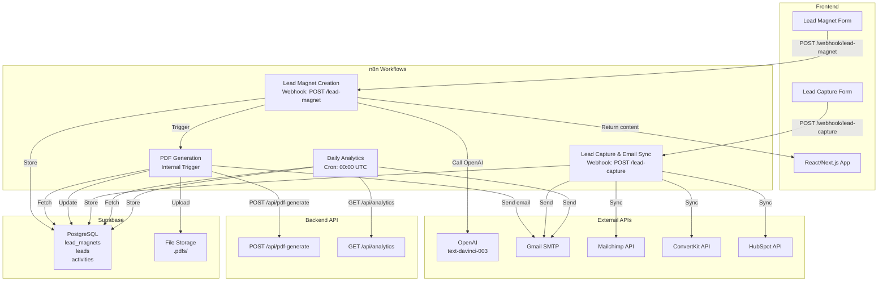

# n8n Workflow Architecture - Phase 1 MVP

## Overview

The n8n automation backbone connects the frontend, backend, and external integrations. It handles:
- **Content Generation** - AI-powered lead magnet creation
- **Document Processing** - PDF generation and storage
- **Lead Management** - Capture and synchronization
- **Analytics** - Daily metrics and reporting

All workflows are webhook-triggered (real-time) or scheduled (daily), with comprehensive error handling and logging.

---

## Architecture Diagram

### System Overview (Mermaid)



### ASCII Architecture Diagram

```
┌────────────────────────────────────────────────────────────────────────────┐
│                          FRONTEND (React/Next.js)                          │
├────────────────────────────────────────────────────────────────────────────┤
│   Lead Magnet Form              │              Lead Capture Form           │
│   (title, topic, niche)         │              (email, lead_magnet_id)     │
└────────┬──────────────────────────────────────────────────┬────────────────┘
         │                                                  │
    POST │ /webhook/lead-magnet                     POST   │ /webhook/lead-capture
         │                                                  │
         ▼                                                  ▼
┌──────────────────────────────────┐   ┌───────────────────────────────────┐
│  Lead Magnet Creation Workflow   │   │ Lead Capture & Email Sync Workflow│
├──────────────────────────────────┤   ├───────────────────────────────────┤
│ 1. Receive lead magnet data      │   │ 1. Receive email & magnet ID      │
│ 2. Call OpenAI API               │   │ 2. Store lead in Supabase         │
│ 3. Wait for response (<30s)      │   │ 3. Send welcome email             │
│ 4. Store in Supabase             │   │ 4. Check integrations             │
│ 5. Trigger PDF Workflow          │   │ 5. Sync to Mailchimp/CK/HubSpot   │
│ 6. Return to frontend            │   │ 6. Update analytics               │
│ ER: Email on failure             │   │ 7. Log activity                   │
│                                  │   │ ER: Queue for retry on failure    │
└────────────┬─────────────────────┘   └───────────────────────────────────┘
             │
             │ Trigger
             ▼
    ┌──────────────────────────┐
    │ PDF Generation Workflow  │
    ├──────────────────────────┤
    │ 1. Fetch data            │
    │ 2. Format HTML           │
    │ 3. Call PDF endpoint     │
    │ 4. Upload to Storage     │
    │ 5. Update Supabase       │
    │ 6. Send confirmation     │
    │ ER: Retry on failure     │
    └──────────────────────────┘

┌────────────────────────────────────────────────────────────────────────────┐
│                    Scheduled: 00:00 UTC Daily                              │
├────────────────────────────────────────────────────────────────────────────┤
│                    Daily Analytics Summary Workflow                        │
├────────────────────────────────────────────────────────────────────────────┤
│ 1. Fetch today's metrics (leads, conversions, performance)                 │
│ 2. Calculate stats (conversion rate, top performer, etc.)                  │
│ 3. Format summary email                                                    │
│ 4. Send via Gmail                                                          │
│ 5. Store summary for dashboard                                             │
│ ER: Log failures, don't interrupt                                          │
└────────────────────────────────────────────────────────────────────────────┘

                              ┌─────────────────┐
                              │  BACKEND API    │
                              ├─────────────────┤
                              │ /api/pdf-gen    │
                              │ /api/analytics  │
                              └─────────────────┘
                                    ▲   ▲
                                    │   │
        ┌───────────────────────────┘   └───────────────────────────┐
        │                                                           │
        ▼                                                           ▼
   ┌──────────────┐                                          ┌────────────┐
   │  Supabase    │                                          │  External  │
   ├──────────────┤                                          │   APIs     │
   │ Database:    │                                          ├────────────┤
   │ - leads      │                                          │ OpenAI     │
   │ - magnets    │                                          │ Gmail      │
   │ - activities │                                          │ Mailchimp  │
   │              │                                          │ ConvertKit │
   │ Storage:     │                                          │ HubSpot    │
   │ - .pdfs/     │                                          └────────────┘
   └──────────────┘
```

---

## Data Flow - Lead Magnet Creation

```
User fills form with:
├─ Title
├─ Topic
├─ Niche
└─ Type (PDF/Email/Video)
        │
        ▼
   Webhook POST to n8n
        │
        ├─→ Receive data
        │
        ├─→ Call OpenAI API
        │   └─ Prompt: Generate lead magnet with chapters, CTA
        │   └─ Wait max 30 seconds
        │
        ├─→ Store raw content in Supabase
        │   └─ INSERT into lead_magnets table
        │   └─ status: 'generating'
        │
        ├─→ Trigger PDF Workflow
        │   │
        │   ├─→ Fetch lead magnet details
        │   │
        │   ├─→ Format as HTML
        │   │
        │   ├─→ Call backend /api/pdf-generate
        │   │
        │   ├─→ Upload PDF to Supabase Storage
        │   │
        │   ├─→ Update lead_magnets: status='published', pdf_url=...
        │   │
        │   └─→ Send confirmation email
        │
        └─→ Return to frontend
            └─ 200 OK with content preview
```

---

## Data Flow - Lead Capture

```
User submits form with:
├─ Email
└─ Lead Magnet ID
        │
        ▼
   Webhook POST to n8n
        │
        ├─→ Receive & validate email
        │
        ├─→ Store in Supabase
        │   └─ INSERT into leads table
        │   └─ status: 'new'
        │
        ├─→ Send welcome email
        │   └─ Email template: welcome email
        │
        ├─→ Fetch user's integrations
        │   └─ Query: SELECT integrations FROM users WHERE id=...
        │
        ├─→ For each integration:
        │   │
        │   ├─ IF Mailchimp enabled:
        │   │  └─ POST /3.0/lists/{list_id}/members
        │   │
        │   ├─ IF ConvertKit enabled:
        │   │  └─ POST /v3/subscribers
        │   │
        │   └─ IF HubSpot enabled:
        │      └─ POST /crm/v3/objects/contacts
        │
        ├─→ Update analytics
        │   └─ leads_today ++
        │
        └─→ Log activity
            └─ INSERT into activity_log
```

---

## Data Flow - Daily Analytics

```
Trigger: 00:00 UTC
        │
        ├─→ Query Supabase
        │   ├─ SELECT COUNT(*) FROM leads WHERE DATE(created_at) = TODAY
        │   ├─ SELECT COUNT(*) FROM conversions WHERE DATE(created_at) = TODAY
        │   └─ SELECT * FROM lead_magnets ORDER BY views DESC LIMIT 5
        │
        ├─→ Call backend /api/analytics
        │   └─ GET /analytics?date=TODAY
        │   └─ Returns: { leads, conversions, revenue, top_performers }
        │
        ├─→ Calculate stats
        │   ├─ Conversion rate = (conversions / leads) * 100
        │   ├─ Top performer = magnet with most views
        │   └─ Revenue = total_value_this_month
        │
        ├─→ Format HTML email
        │   └─ Template: daily_summary.html
        │   └─ Fill variables: {{leads}}, {{rate}}, {{top}}, {{revenue}}
        │
        ├─→ Send via Gmail SMTP
        │   └─ TO: user@example.com
        │   └─ SUBJECT: Daily Summary - {{date}}
        │
        └─→ Store summary for dashboard
            └─ INSERT into analytics_summaries table
```

---

## Integration Points

### 1. Frontend → n8n (Webhooks)

**Lead Magnet Creation**
```
POST /webhook/lead-magnet
Content-Type: application/json

{
  "title": "The Complete Guide to...",
  "topic": "Content Marketing",
  "niche": "SaaS",
  "type": "pdf",
  "user_id": "uuid"
}
```

**Lead Capture**
```
POST /webhook/lead-capture
Content-Type: application/json

{
  "email": "user@example.com",
  "lead_magnet_id": "uuid",
  "source": "landing-page",
  "user_id": "uuid"
}
```

### 2. n8n → Backend API

**PDF Generation**
```
POST /api/pdf-generate
Authorization: Bearer {JWT_TOKEN}
Content-Type: application/json

{
  "content": "HTML string",
  "title": "Lead Magnet Title",
  "filename": "lead-magnet-uuid.pdf"
}

Response:
{
  "success": true,
  "pdf_url": "https://storage.example.com/pdfs/...",
  "file_size": 1024000
}
```

**Analytics**
```
GET /api/analytics?date=2024-03-16
Authorization: Bearer {JWT_TOKEN}

Response:
{
  "date": "2024-03-16",
  "leads": 42,
  "conversions": 12,
  "revenue": 1200,
  "top_magnets": [...]
}
```

### 3. n8n → Supabase

**Direct PostgreSQL queries**
- Store lead magnets
- Store leads
- Store activities
- Fetch user integrations
- Update statuses

**File Storage**
- Upload PDFs to `/pdfs/` bucket
- Store download URLs

### 4. n8n → External APIs

**OpenAI API**
```
POST https://api.openai.com/v1/chat/completions
Authorization: Bearer {OPENAI_API_KEY}

{
  "model": "gpt-4",
  "messages": [
    {
      "role": "system",
      "content": "You are an expert lead magnet creator..."
    },
    {
      "role": "user",
      "content": "Create lead magnet: title=..., topic=..., niche=..."
    }
  ],
  "temperature": 0.7,
  "max_tokens": 2000
}
```

**Gmail SMTP**
```
From: noreply@example.com
To: user@example.com
SMTP: smtp.gmail.com:587
Authentication: OAuth2 / App Password
```

**Mailchimp API**
```
POST https://us1.api.mailchimp.com/3.0/lists/{list_id}/members
Authorization: Basic {base64(apikey)}

{
  "email_address": "user@example.com",
  "status": "subscribed",
  "merge_fields": {
    "FNAME": "John",
    "LNAME": "Doe"
  }
}
```

**ConvertKit API**
```
POST https://api.convertkit.com/v3/subscribers
Authorization: Token {CONVERTKIT_API_KEY}

{
  "email": "user@example.com",
  "first_name": "John",
  "api_secret": "{API_SECRET}"
}
```

**HubSpot API**
```
POST https://api.hubapi.com/crm/v3/objects/contacts
Authorization: Bearer {HUBSPOT_API_KEY}

{
  "properties": [
    {
      "name": "email",
      "value": "user@example.com"
    },
    {
      "name": "firstname",
      "value": "John"
    }
  ]
}
```

---

## Error Handling Strategy

### Level 1: Validation
- Validate input data before processing
- Check required fields
- Validate email format
- Check API credentials

### Level 2: API Errors
- Retry on 429 (rate limit)
- Retry on 5xx errors (3 attempts with exponential backoff)
- Fail immediately on 4xx errors (except 429)
- Log all errors to Supabase

### Level 3: Notifications
- If Lead Magnet creation fails → Email admin
- If PDF generation fails → Queue for retry
- If email send fails → Log and retry (max 3 times)
- If integration sync fails → Queue for retry

### Level 4: Recovery
- All failed tasks logged with retry queue
- Admin dashboard shows retry queue
- Manual retry button available
- Exponential backoff: 1min, 5min, 30min, 4h

---

## Database Schema Integration

### lead_magnets table
```sql
CREATE TABLE lead_magnets (
  id UUID PRIMARY KEY,
  user_id UUID NOT NULL,
  title VARCHAR(255) NOT NULL,
  topic VARCHAR(255),
  niche VARCHAR(255),
  type VARCHAR(50),
  content JSONB,
  pdf_url VARCHAR(500),
  status VARCHAR(50),
  views INT DEFAULT 0,
  conversions INT DEFAULT 0,
  created_at TIMESTAMP DEFAULT NOW(),
  updated_at TIMESTAMP DEFAULT NOW()
);
```

### leads table
```sql
CREATE TABLE leads (
  id UUID PRIMARY KEY,
  user_id UUID NOT NULL,
  lead_magnet_id UUID,
  email VARCHAR(255) NOT NULL,
  first_name VARCHAR(100),
  last_name VARCHAR(100),
  status VARCHAR(50),
  integrations_synced JSONB,
  created_at TIMESTAMP DEFAULT NOW(),
  updated_at TIMESTAMP DEFAULT NOW()
);
```

### activity_log table
```sql
CREATE TABLE activity_log (
  id UUID PRIMARY KEY,
  user_id UUID NOT NULL,
  action VARCHAR(100),
  entity_type VARCHAR(50),
  entity_id UUID,
  details JSONB,
  created_at TIMESTAMP DEFAULT NOW()
);
```

### analytics_summaries table
```sql
CREATE TABLE analytics_summaries (
  id UUID PRIMARY KEY,
  user_id UUID NOT NULL,
  date DATE NOT NULL,
  leads INT,
  conversions INT,
  conversion_rate FLOAT,
  top_magnets JSONB,
  revenue FLOAT,
  created_at TIMESTAMP DEFAULT NOW()
);
```

---

## Workflow Execution Times (SLA)

| Workflow | Trigger | Target Time | Timeout |
|----------|---------|------------|---------|
| Lead Magnet Creation | Webhook | <2 seconds | 35s |
| PDF Generation | Internal | <10 seconds | 60s |
| Lead Capture | Webhook | <2 seconds | 30s |
| Daily Analytics | Cron 00:00 UTC | <5 minutes | 30m |

---

## Security Considerations

✅ **Authentication**
- All backend API calls include JWT token
- All external APIs use credentials from n8n secure storage
- Webhook endpoints validate API key

✅ **Data Protection**
- All sensitive data stored in Supabase (encrypted at rest)
- PDFs stored in private bucket
- Email addresses hashed for analytics

✅ **Rate Limiting**
- OpenAI: 3 calls/minute
- Mailchimp: 10 calls/second
- Gmail: 10M/day quota
- ConvertKit: 300 calls/minute
- HubSpot: 100 calls/10 seconds

✅ **Error Handling**
- Never expose API keys in logs
- Email errors to admin (not user)
- Implement request/response timeout
- Validate all external responses

---

## Monitoring & Logging

All workflows log to Supabase:
- Execution start/end time
- Success/failure status
- Error messages
- API response times
- Data processed

Dashboard queries metrics from:
- `activity_log` - Track what happened
- `analytics_summaries` - Daily snapshots
- n8n execution history - Workflow stats

---

## Next Steps

1. See `SETUP_GUIDE.md` for detailed setup
2. Import workflows from `workflows/` folder
3. Configure credentials in `configs/credentials.md`
4. Test with scripts in `scripts/` folder
5. Deploy using `DEPLOYMENT.md`

